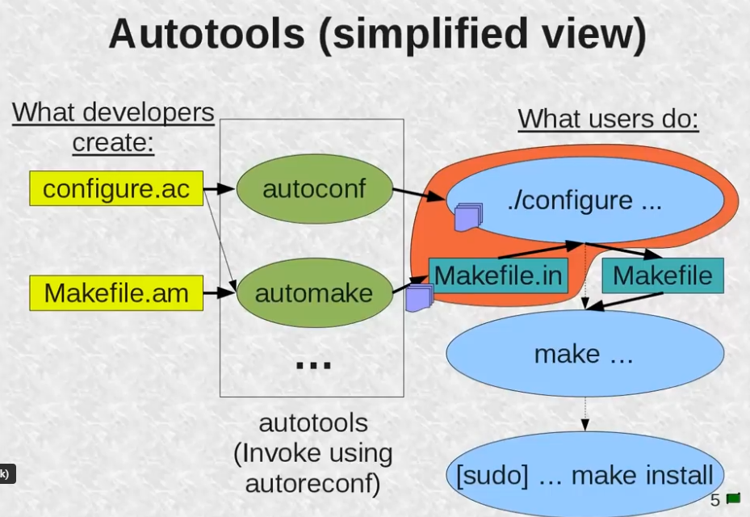

# autotools
          
#### Developer Workflow:
Create configure.ac (configuration template) and Makefile.am (Automake file).
##### Way 1:
Run ```aclocal``` to generate aclocal.m4.           
Run ```autoconf``` to generate configure.           
Run ```automake --add-missing``` to generate Makefile.in.           
##### Way 2
Run ```autoreconf -i``` same effect with 3 commands above ^^.           
The repository now includes configure.ac, Makefile.in, and configure.           

#### User Workflow:
Run ./configure to generate a Makefile from Makefile.in based on the system.                
Run ```make``` to compile the project.              
Run ```make install``` to install the binaries.             
